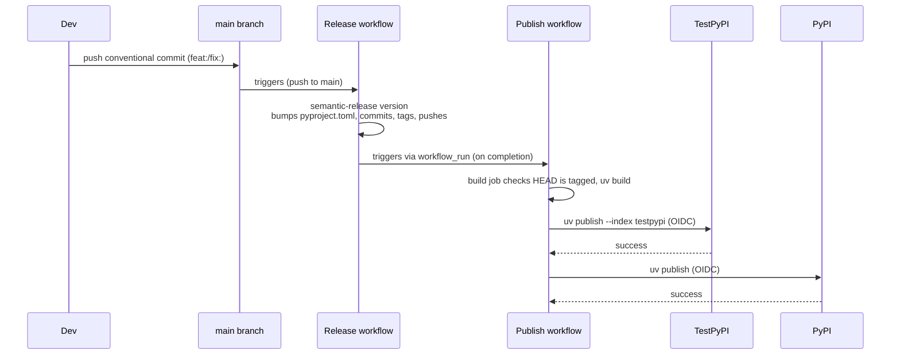

# destiny-deduper

A suite of tools for deduplicating citatations for publications.

## tl, dr

In large repositories of published works, we want to ensure that a given citation is not a duplicate of another. Hence the goal of this `destiny-deduper` is to provide a set of portable, customisable solutions for quantifying the likelihood that a given citation is a duplicate of another.

## Installing `destiny-deduper`

If you just want to use `destiny-deduper`, you can install using `pip`:

```sh
pip install destiny-deduper
```

`uv` is often preferred over vanilla `pip`:

```sh
uv add destiny-deduper
```

### Developer install

If you want to contribute to `destiny-deduper`, follow the following steps:

1. Install `uv`

[uv](https://docs.astral.sh/uv) is used for dependency management and managing virtual environments. You can install uv either using pipx or the uv installer script:

```sh
curl -LsSf https://astral.sh/uv/install.sh | sh
```

1. Install project & dependencies

Once uv is installed, install dependencies:

```sh
uv sync
```

1. Optional - activate your environment

```sh
source .venv/bin/activate
```

## Using `destiny-deduper`

`destiny-deduper` was built with the priority of using it to run as a constant background job on citations stored in `destiny-repository` which may be duplicates of one another. Hence, this library may feature certain design decisions which mean it doesn't necessarily lend itself to your (local, or otherwise) use case. However, you can do a lot with what's here!

### Using destiny `Reference`s

```python
from uuid import uuid4

from destiny_sdk.identifiers import DOIIdentifier, ExternalIdentifierType
from destiny_sdk.references import Reference

from destiny_deduper.data_models import convert_ref_to_paper
from destiny_deduper.dedupe import Deduper

ref_a = Reference(
    id=str(uuid4()),
    identifiers=[
        DOIIdentifier(
            identifier="10.1000/xyz123",
            identifier_type=ExternalIdentifierType.DOI,
        )
    ],
    enhancements=[],
)

ref_b = Reference(
    id=str(uuid4()),
    identifiers=[
        DOIIdentifier(
            identifier="10.1000/xyz123",
            identifier_type=ExternalIdentifierType.DOI,
        )
    ],
    enhancements=[],
)

paper_a = convert_ref_to_paper(ref_a)
paper_b = convert_ref_to_paper(ref_b)

deduper = Deduper(reference=paper_a, candidates=[paper_b])
probability = deduper.dedupe_weighted(paper_a, paper_b)

print(probability)
```

### Using citations imported from csv

```python
from destiny_deduper.algorithm.import_references import (
    CsvLoadConfig,
    load_reference_csv,
)
from destiny_deduper.dedupe import Deduper

papers = load_reference_csv(
    "records.csv",
    CsvLoadConfig(include_record_id=True),
)

paper_a = papers[0]
paper_b = papers[1]

deduper = Deduper(reference=paper_a, candidates=[paper_b])
result = deduper.score_pair(paper_a, paper_b)

print(result.probability)
print(result.label)
```

## How we got here

Please see all the code in `destiny_deduper/algorithm/`, as well as `notebooks` for more info on the underlying research and study that went into developing the algorithm, thresholds and weights underlying `destiny-deduper`. You can also read `deduplication_workflows.md` for more info.

## Contributing

If you want to contribute to this project -- awesome, everyone's welcome.
Please see the [contributing guidelines](CONTRIBUTING.md) for details on how best to contribute.

A few important steps when contributing:

```sh
uv run pre-commit install --hook-type commit-msg
```

This will force you to use [conventional commits](https://www.conventionalcommits.org/en/v1.0.0/).

### Commit message format

All commits must use [**conventional commits**](conventionalcommits.org). The pre-commit hook will reject any commit that doesn't.

| prefix | example | version effect |
| --- | --- | --- |
| `fix:` | `fix: handle null input` | patch: `0.1.0 -> 0.1.1` |
| `feat:` | `feat: add login page` | minor: `0.1.0 -> 0.2.0` |
| `feat!:` or `BREAKING CHANGE:` footer | `feat!: remove legacy api` | major: `0.1.0 -> 1.0.0` |
| `chore:`, `docs:`, `ci:`, `test:` | `chore: update deps` | no bump |

## Release flow


